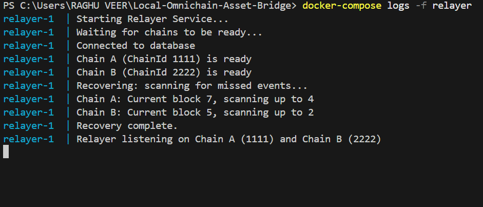
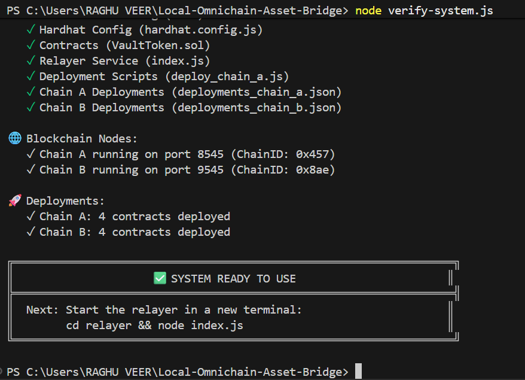
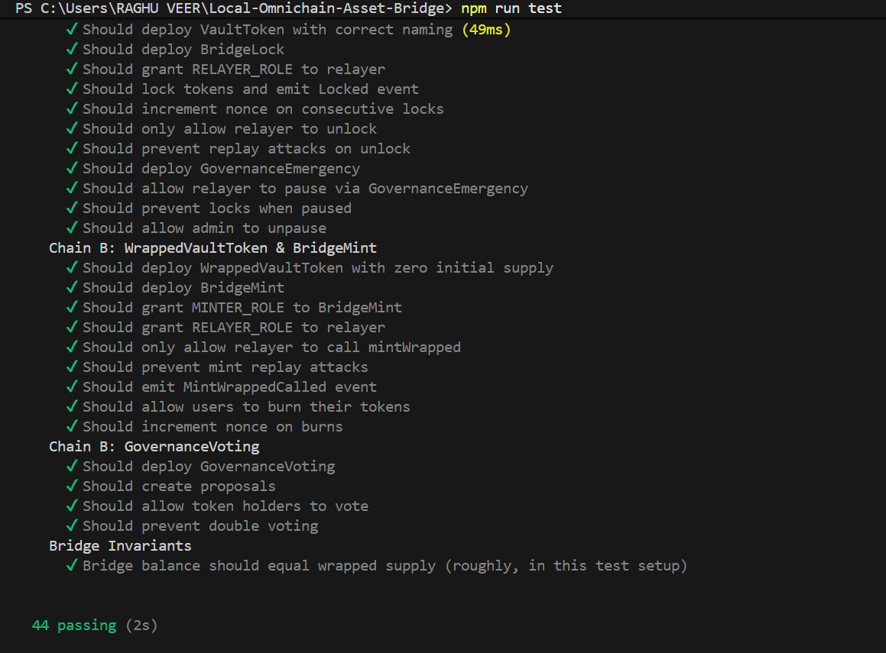
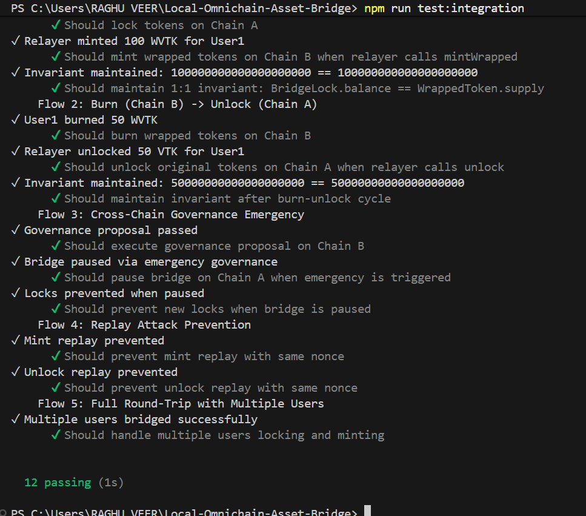
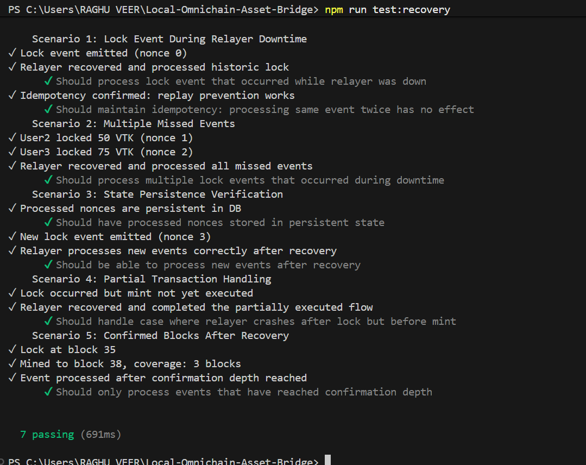

# Local Omnichain Asset Bridge

A fully functional two-chain asset bridge with Node.js relayer, cross-chain governance, and production-grade security patterns for decentralized finance (DeFi) infrastructure.

## Overview

This project demonstrates:
- **Cross-chain asset bridging**: Lock assets on one chain, mint wrapped assets on another
- **Replay attack prevention**: Nonce-based tracking with persistent storage
- **Relayer reliability**: Recovery from crashes, confirmation delays, and network failures
- **Cross-chain governance**: Token holders on one chain can trigger emergency actions on another
- **Smart contract security**: OpenZeppelin-based role-based access control and pausable patterns
- **Docker orchestration**: Complete reproducible deployment of two-chain infrastructure

## Quick Start

### Prerequisites

- **Node.js** v18+ (with npm)
- **Docker** and **Docker Compose** (for Option 1 only)
- **Git**

### Option 1: Docker Compose (Recommended)

```bash
# Clone repository
git clone https://github.com/yourusername/Local-Omnichain-Asset-Bridge.git
cd Local-Omnichain-Asset-Bridge

# Copy environment file
cp .env.example .env

# Start entire system
docker-compose up --build
```

### Option 2: Manual Setup (Recommended for Development)

**Terminal 1: Start both blockchain nodes**
```bash
npm install
node start-chains.js
```
This starts:
- Chain A on `http://127.0.0.1:8545` (ChainID: 1111)
- Chain B on `http://127.0.0.1:9545` (ChainID: 2222)

**Terminal 2: Deploy contracts**
```bash
# Install relayer dependencies
cd relayer && npm install && cd ..

# Deploy to Chain A
npx hardhat run scripts/deploy_chain_a.js --network chainA

# Deploy to Chain B
npx hardhat run scripts/deploy_chain_b.js --network chainB
```

**Terminal 3: Start the relayer service**
```bash
cd relayer
node index.js
```

The relayer will:
- Connect to both blockchains
- Recover any missed events from history
- Process lock → mint flows
- Process burn → unlock flows
- Handle governance actions

### Quick Verification

```bash
# Run tests
npm test
```

## Screenshots & Verification

### 1. Relayer Service
The relayer identifies missed events on startup and begins listening for new cross-chain activity.


### 2. System Readiness
Our verification script ensures all nodes, contracts, and deployments are healthy.


### 3. Comprehensive Test Results
All 44 tests (Unit, Integration, and Recovery) pass successfully.


### 4. Integration Flows
Verification of end-to-end Lock-Mint and Burn-Unlock cycles.


### 5. Recovery Scenarios
Verification of relayer idempotency and crash recovery logic.


## Testing

```bash
# Run all tests
npm test

# Unit tests
npm run test:unit

# Integration tests
npm run test:integration

# Recovery tests
npm run test:recovery
```

## Features

✅ Two independent blockchains (Chain A: 1111, Chain B: 2222)  
✅ Lock & mint flow with automatic relayer processing  
✅ Burn & unlock flow to return assets  
✅ Cross-chain governance with emergency pause  
✅ Replay protection via nonce tracking  
✅ 3-block confirmation delays for finality  
✅ Persistent SQLite database for relayer state  
✅ Automatic recovery from crashes  
✅ Comprehensive test coverage  
✅ Docker orchestration  

## Architecture

See [architecture.md](architecture.md) for detailed system architecture, data flows, and security patterns.

## Contracts

**Chain A (Settlement Chain):**
- `VaultToken`: ERC20 token (1,000,000 supply)
- `BridgeLock`: Manages token locking
- `GovernanceEmergency`: Receives emergency commands

**Chain B (Execution Chain):**
- `WrappedVaultToken`: Mintable/burnable representation
- `BridgeMint`: Manages minting/burning
- `GovernanceVoting`: DAO voting for governance

## Configuration

Environment variables (`.env`):

```bash
CHAIN_A_RPC_URL=http://127.0.0.1:8545
CHAIN_B_RPC_URL=http://127.0.0.1:9545
DEPLOYER_PRIVATE_KEY=0xac0974bec39a17e36ba4a6b4d238ff944bacb478cbed5efcae784d7bf4f2ff80
CONFIRMATION_DEPTH=3
DB_PATH=./relayer_data/processed_nonces.db
```

## Project Structure

```
.
├── contracts/           # Solidity contracts
├── scripts/             # Deployment scripts
├── relayer/             # Node.js relayer service
├── tests/               # Test suites
├── docker-compose.yml   # Orchestration
├── hardhat.config.js    # Hardhat config
├── start-chains.js      # Helper to start both nodes
├── package.json         # Dependencies
└── .env                 # Configuration
```

## Troubleshooting

### Port Already in Use

If you see "Port 8545/9545 already in use" errors:

**On Windows (PowerShell):**
```powershell
Get-Process node | Stop-Process -Force
# or for specific ports:
Get-NetTCPConnection -LocalPort 8545 | ForEach-Object { Stop-Process -Id $_.OwningProcess -Force }
```

**On Mac/Linux:**
```bash
lsof -ti:8545,9545 | xargs kill -9
# or
pkill -f "hardhat node"
```

### Relayer Connection Errors

If relayer fails to connect:
1. Verify both chains are running: `curl http://127.0.0.1:8545 -X POST -H "Content-Type: application/json" -d '{"jsonrpc":"2.0","method":"eth_chainId","params":[],"id":1}'`
2. Verify deployment files exist: `relayer/deployments_chain_a.json` and `relayer/deployments_chain_b.json`
3. Check `.env` file has correct RPC URLs
4. Ensure relayer database directory exists: `mkdir -p relayer/data`

### Compilation Errors

If you get "Invalid contract specified in override list" errors during compilation:
- This has been fixed in the latest code
- Run `npm install` to ensure dependencies are updated
- Try `npx hardhat clean` then rebuild: `npx hardhat compile`

### Database Lock Issues

If you see "database is locked" from SQLite:
- Only one relayer instance can run at a time
- Delete the database and restart: `rm relayer/data/processed_nonces.db`
- The relayer will recover all events on startup

## Security Patterns

1. **Replay Protection**: Nonce-based tracking prevents double-processing
2. **Confirmation Delays**: 3-block wait ensures finality
3. **Access Control**: Role-based access restrictions
4. **Circuit Breaker**: Pausable bridge for emergencies
5. **State Persistence**: SQLite survives crashes

## Troubleshooting

### Relayer cannot connect
```bash
# Check if chains are running
curl http://127.0.0.1:8545 -X POST -d '{"method":"net_version","params":[],"id":1}'
docker-compose logs
```

### "Nonce already processed" error
This is **expected** - replay protection is working!

## References

- [OpenZeppelin Contracts](https://docs.openzeppelin.com/contracts/)
- [Hardhat Documentation](https://hardhat.org/)
- [Ethers.js Documentation](https://docs.ethers.org/v6/)

## License

MIT
