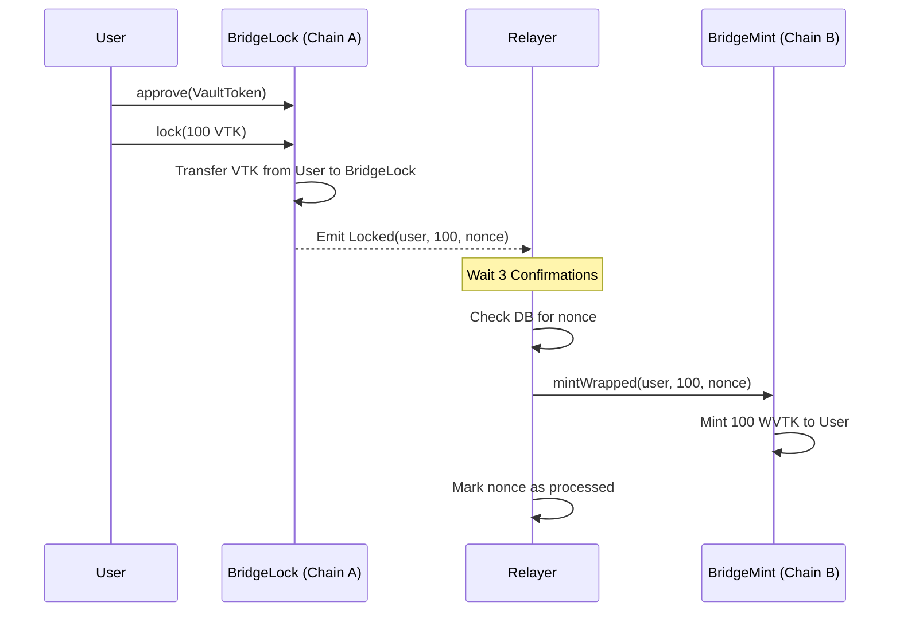
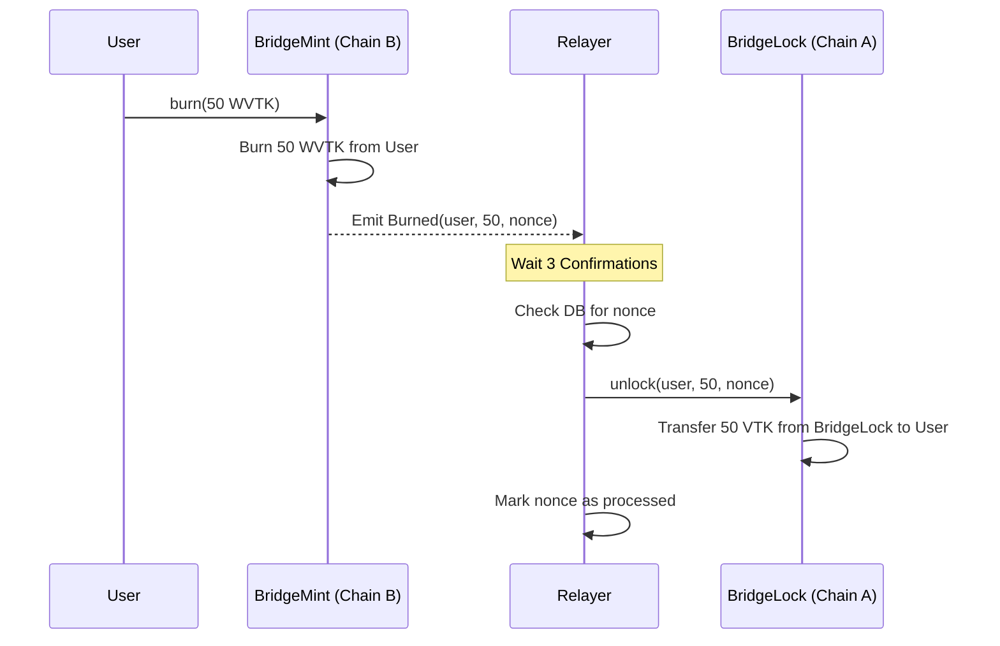
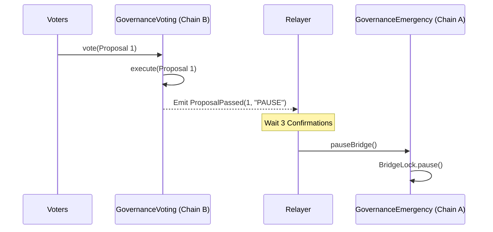

# System Architecture

## Overview
The Local Omnichain Asset Bridge facilitates the transfer of assets between two independent EVM-compatible blockchains (Chain A and Chain B). It uses a lock-and-mint mechanism secured by an off-chain relayer service.

## Components

### Chain A (Settlement Chain)
- **VaultToken (VTK)**: The native ERC20 token being bridged.
- **BridgeLock**: The central bridge contract.
    - **Lock**: Users deposit VTK, which are locked in the contract. Emits `Locked` event.
    - **Unlock**: Can only be called by the `RELAYER_ROLE`. Releases VTK to users upon proof of burn on Chain B.
    - **Pause**: Emergency stop mechanism, triggered by the relayer.
- **GovernanceEmergency**:
    - **PauseBridge**: Allows executing emergency actions (like pausing `BridgeLock`) when authorized by governance on Chain B.

### Chain B (Execution Chain)
- **WrappedVaultToken (WVTK)**: Represents the bridged asset. Mintable/Burnable.
- **BridgeMint**:
    - **Mint**: Can only be called by the `RELAYER_ROLE`. Mints WVTK to users corresponding to locked tokens on Chain A.
    - **Burn**: Users burn WVTK to retrieve original assets on Chain A. Emits `Burned` event.
- **GovernanceVoting**:
    - **Propose/Vote**: Token holders can vote on proposals (e.g., "Pause Bridge").
    - **Execute**: Emits `ProposalPassed` event if the vote succeeds.

### Relayer Service (Node.js)
- **Watcher**: Listens for events on both chains (`Locked`, `Burned`, `ProposalPassed`).
- **Processor**:
    - Waits for **3 block confirmations** to ensure finality.
    - Checks **Nonce Database** (SQLite) to prevent replay attacks.
    - Submits corresponding transactions to the destination chain.
    - Updates database upon success.
- **Recovery**: On startup, scans past blocks to process any missed events.

## Workflow

### 1. Bridging Assets (Chain A -> Chain B)

### 2. Redeeming Assets (Chain B -> Chain A)

### 3. Emergency Governance (Chain B -> Chain A)

