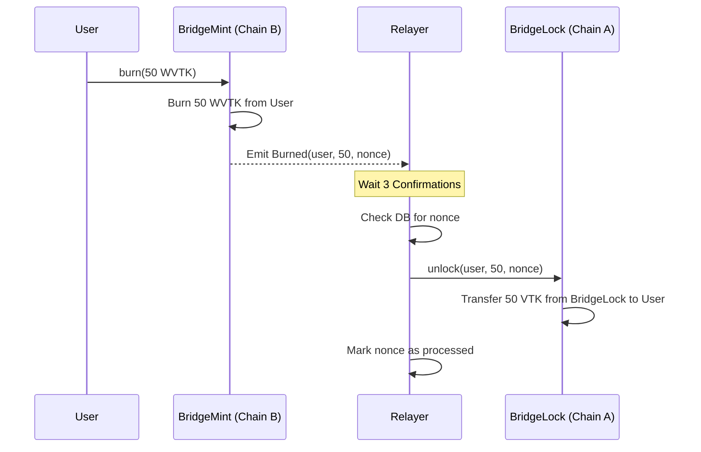
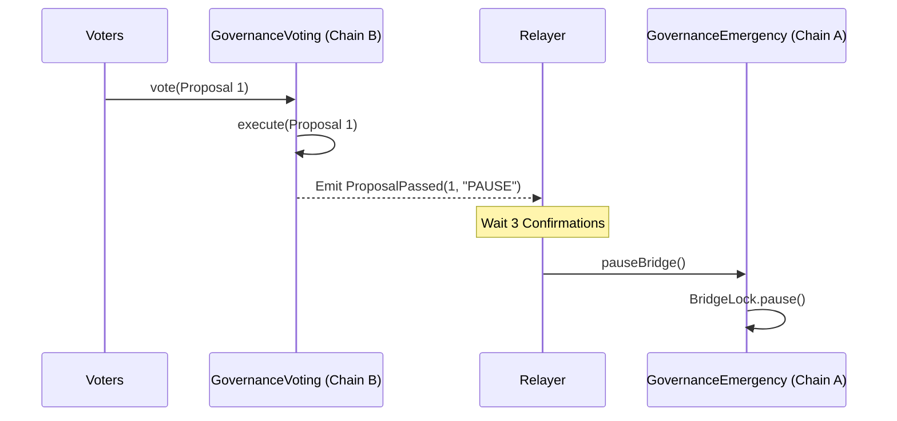

# Local Omnichain Asset Bridge - System Architecture

## Overview

The **Local Omnichain Asset Bridge** is a two-chain asset bridge system that demonstrates real-world cross-chain interoperability using:

- **Two independent EVM blockchains** (Hardhat local nodes)
- **Lock-and-mint bridge mechanism** with replay protection
- **Node.js relayer service** for event processing and cross-chain messaging
- **Cross-chain governance** for emergency controls
- **Docker containerization** for reproducible deployment

## System Components

### Blockchain Layer

#### Chain A: Settlement Chain (Port 8545, ChainId: 1111)

**Deployed Contracts:**

1. **VaultToken (VTK)**
   - Standard ERC20 token
   - Initial supply: 1,000,000 tokens
   - Used as the source asset for bridging

2. **BridgeLock**
   - Manages locking of VaultToken on Chain A
   - **Key Functions:**
     - `lock(uint256 amount)`: User deposits VTK, contract holds them, emits `Locked` event with nonce
     - `unlock(address user, uint256 amount, uint256 nonce)`: Relayer releases VTK to user (replay-protected)
     - `pause()`: Emergency pause (RELAYER_ROLE only)
   - **Invariant Maintained:** `BridgeLock.balanceOf(VTK) == WrappedVaultToken.totalSupply()`

3. **GovernanceEmergency**
   - Receives emergency governance signals from Chain B
   - **Key Functions:**
     - `pauseBridge()`: Pauses BridgeLock to halt all operations (RELAYER_ROLE only)
     - `unpauseBridge()`: Resumes operations (DEFAULT_ADMIN_ROLE only)

#### Chain B: Execution Chain (Port 9545, ChainId: 2222)

**Deployed Contracts:**

1. **WrappedVaultToken (WVTK)**
   - ERC20 token representing locked VaultToken
   - Mintable/Burnable by BridgeMint contract
   - Total supply = VaultToken locked on Chain A

2. **BridgeMint**
   - Manages minting and burning of WrappedVaultToken
   - **Key Functions:**
     - `mintWrapped(address user, uint256 amount, uint256 nonce)`: Relayer mints WVTK (replay-protected)
     - `burn(uint256 amount)`: User burns WVTK to initiate unlock on Chain A, emits `Burned` event with nonce

3. **GovernanceVoting**
   - Implements DAO-style voting for token holders
   - **Key Functions:**
     - `createProposal(string description)`: Creates governance proposal
     - `vote(uint256 proposalId)`: Vote with token balance as voting power
     - Auto-executes when threshold (1000 tokens) is reached
     - Emits `ProposalPassed(proposalId, data)` for relayer to process

### Relayer Service (Node.js)

**Location:** `/relayer` directory

**Responsibilities:**

1. **Event Listening**
   - Monitors Chain A for `Locked` events
   - Monitors Chain B for `Burned` and `ProposalPassed` events
   - Uses ethers.js with event filtering and block tracking

2. **Confirmation Tracking**
   - Waits for 3 block confirmations before processing
   - Prevents processing events from unconfirmed/forked blocks
   - Maintains `lastProcessedBlockA` and `lastProcessedBlockB` tracking

3. **Nonce Persistence**
   - SQLite database stores processed (chainId, nonce) pairs
   - Prevents replay attacks
   - Survives relayer restarts via Docker volume mounting

4. **Recovery Protocol**
   - On startup, scans all past blocks
   - Loads nonces from database
   - Processes any missed events from confirmed period
   - Ensures no events are lost during downtime

5. **Error Handling**
   - Retries failed RPC calls
   - Handles contract reversions gracefully
   - Recognizes idempotent operations

6. **Cross-Chain Message Processing**
   - **Locked → MintWrapped**: Transfers nonce from Lock event to mint call
   - **Burned → Unlock**: Transfers nonce from Burn event to unlock call
   - **ProposalPassed → PauseBridge**: Executes emergency action on Chain A

## Data Flows

### Flow 1: Lock & Mint (Chain A → Chain B)

```
1. User locks on Chain A
  └─ VaultToken transferred to BridgeLock
  └─ Locked(user, amount, nonce) event emitted
  
2. Relayer observes event after 3 confirmations
  └─ Checks: Is nonce in database? (NO)
  └─ Calls: bridgeMint.mintWrapped(user, amount, nonce)
  
3. Chain B receives mint call
  └─ Checks: Is nonce already processed? (NO)
  └─ Marks: nonce as processed
  └─ Mints: WVTK to user
  
4. Relayer confirms transaction
  └─ Marks: (ChainId, nonce) in SQLite
  └─ User now has WVTK equal to VTK locked
```

### Flow 2: Burn & Unlock (Chain B → Chain A)

```
1. User burns on Chain B
  └─ WVTK transferred from user to contract and burned
  └─ Burned(user, amount, nonce) event emitted
  
2. Relayer observes event after 3 confirmations
  └─ Checks: Is nonce in database? (NO)
  └─ Calls: bridgeLock.unlock(user, amount, nonce)
  
3. Chain A receives unlock call
  └─ Checks: Is nonce already processed? (NO)
  └─ Marks: nonce as processed
  └─ Transfers: VTK from BridgeLock to user
  
4. Relayer confirms transaction
  └─ Marks: (ChainId, nonce) in SQLite
  └─ User now has VTK restored
```

### Flow 3: Cross-Chain Governance (Chain B → Chain A)

```
1. Proposal on Chain B reaches vote threshold
  └─ Vote count >= 1000 WVTK
  └─ ProposalPassed(proposalId, data) event emitted
  └─ Proposal marked as executed
  
2. Relayer observes ProposalPassed after 3 confirmations
  └─ Checks: Is proposalId already processed? (NO using GOV-{id} key)
  └─ Calls: governanceEmergency.pauseBridge()
  
3. Chain A receives emergency pause call
  └─ BridgeLock enters PAUSED state
  └─ All lock/unlock operations revert
  └─ Prevents exploit escalation
  
4. Admin can later unpause after situation is resolved
```

## Security Features

### 1. Replay Protection

**Mechanism:** Nonce-based tracking with on-chain and off-chain persistence

- Each bridge operation has a unique nonce
- Contract tracks `processedNonces[nonce] = true`
- Relayer database independently tracks processed events
- Second attempt with same nonce fails on-chain check

**Attack Prevented:**
```javascript
// First call: SUCCESS
bridgeMint.mintWrapped(user, amount, nonce=5);

// Second call: REVERTED with "Nonce already processed"
bridgeMint.mintWrapped(user, amount, nonce=5);
```

### 2. Confirmation Delays

**Mechanism:** Wait for 3 block confirmations before processing

- Protects against chain reorganizations (reorgs)
- Reduces risk of processing non-finalized events
- Configurable via `CONFIRMATION_DEPTH` environment variable

### 3. Access Control

**Roles Enforced:**

- `DEFAULT_ADMIN_ROLE`: Pause/unpause, role management
- `RELAYER_ROLE`: Lock/unlock, mint/burn operations
- Only relayer address can trigger cross-chain transfers
- Users cannot mint directly or unlock directly

### 4. Pausable Bridge

**Mechanism:** Circuit breaker for emergency situations

- Governance votes can trigger emergency pause
- Paused state prevents new lock operations
- Existing tokens remain locked/safe
- Admin can unpause after investigation

### 5. State Persistence

**Mechanism:** SQLite database with atomic transactions

- Survives relayer crashes and restarts
- Prevents double-processing of events
- Recovers from incomplete transactions
- Volume-mounted in Docker for durability

## Deployment Architecture

### Docker Compose Services

```yaml
Services:
  chain-a: Hardhat node (Port 8545, ChainId 1111)
  chain-b: Hardhat node (Port 9545, ChainId 2222)
  deployer: One-time setup to deploy contracts
  relayer: Node.js service processing events
```

### Volumes

- `relayer_data/`: Persists SQLite database
- `deployments/`: Shares deployment info between services
- `/app/node_modules`: Caches dependencies

### Environment Variables

```bash
CHAIN_A_RPC_URL=http://chain-a:8545
CHAIN_B_RPC_URL=http://chain-b:9545
DEPLOYER_PRIVATE_KEY=0xac0974bec39a17e36ba4a6b4d238ff944bacb478cbed5efcae784d7bf4f2ff80
CONFIRMATION_DEPTH=3
DB_PATH=/app/data/processed_nonces.db
```

## Invariants Maintained

1. **Supply Parity**: `BridgeLock.balanceOf(VTK) == WrappedVaultToken.totalSupply()`
   - Every WVTK minted corresponds to VTK locked
   - Every WVTK burned releases VTK

2. **Nonce Uniqueness**: Each (chainId, nonce) pair processed exactly once
   - Enforced on-chain via mapping
   - Enforced off-chain via SQLite unique constraints

3. **Idempotency**: Relayer can be retried safely
   - Processing same event twice has no effect
   - Second attempt fails gracefully

4. **Finality**: Confirmed events never reverse
   - Waiting for 3 confirmations ensures finality
   - Reorg window typically < 3 blocks on test networks

## Recovery Scenarios

### Scenario 1: Relayer Crashes During Lock Processing

```
t0: User locks 100 VTK
t1: Relayer crashes before calling mintWrapped
t2-3: User cannot access wrapped tokens (bridge appears broken)
t4: Relayer restarts
t5: Recovery scans history, finds Locked event
t6: Recovery calls mintWrapped with original nonce
t7: User now has 100 WVTK (system is consistent)
```

### Scenario 2: Network Partition

```
t0: Relayer running, monitoring both chains
t1: Network partition, can't reach chain-b temporarily
t2: Lock event happens on chain-a (unprocessed)
t3: Network reconnects
t4: Relayer resumes, scans missed blocks
t5: Finds and processes Locked event with mint
t6: System recovers to normal state
```

### Scenario 3: Unfinalized Block Reverted

```
t0: Locked event in block N
t1: Relayer would process in block N+3 (if count < CONFIRMATION_DEPTH)
t2: Block N gets forked out (reorg)
t3: Locked event disappears
t4: Relayer never processed it (still waiting for confirmation)
t5: After reorg settles, new Locked event with same data in block N'
t6: Relayer processes new event correctly
```

## Testing Strategy

### Unit Tests (UnitTests.js)
- Individual contract functions
- Access control enforcement
- Replay attack prevention
- State mutations

### Integration Tests (Integration.js)
- End-to-end lock-and-mint flow
- Burn-and-unlock flow
- Cross-chain governance
- Multi-user scenarios
- Invariant verification

### Recovery Tests (Recovery.js)
- Crash and restart scenarios
- Multiple missed events
- State persistence
- Partial transaction handling
- Confirmation depth behavior

## Performance Characteristics

- **Lock latency**: 1 transaction on Chain A + 1 transaction on Chain B after 3 confirmations
- **Confirmation time**: ~3 blocks (depends on chain block time)
- **Total bridging time**: ~1-2 minutes (test net)
- **Throughput**: Limited by relayer polling frequency (2-second intervals) and block production

## Future Enhancements

1. **Multi-relayer architecture**: Multiple relayers voting on state
2. **Threshold signatures**: m-of-n signature scheme for relayer set
3. **Light client validation**: Verify source chain state on destination
4. **Fee mechanisms**: Charge for bridge services
5. **Cross-chain contract calls**: Beyond simple token bridging
6. **Upgradeable contracts**: Proxy pattern for fixes and enhancements
    Relayer->>Relayer: Check DB for nonce
    
    Relayer->>ChainB: mintWrapped(user, 100, nonce)
    ChainB->>ChainB: Mint 100 WVTK to User
    Relayer->>Relayer: Mark nonce as processed
```

### 2. Redeeming Assets (Chain B -> Chain A)


### 3. Emergency Governance (Chain B -> Chain A)

